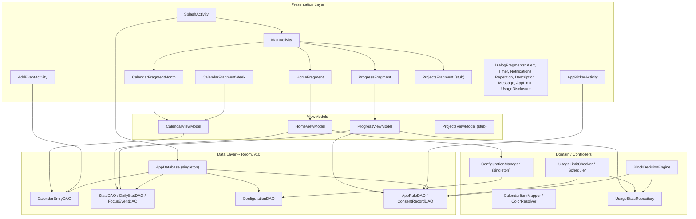
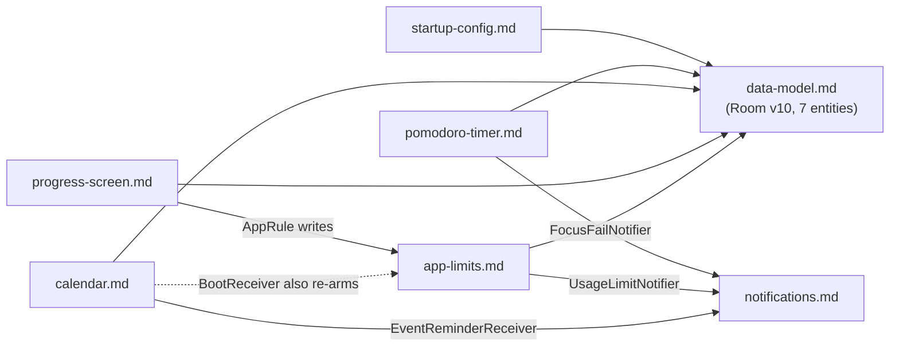
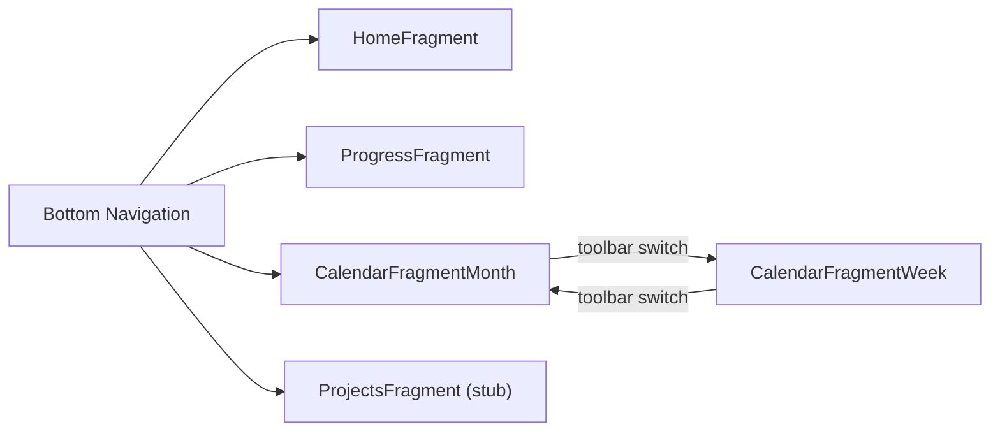

# BBetterCalendar — Architecture

Single-module Android app written in **Java 8** that combines a Pomodoro-style study timer with a calendar for managing events, tasks, and reminders. Tracks daily study time, streaks, phone/app usage, and usage limits.

> Version source of truth: [`app/build.gradle`](../../app/build.gradle) and [`build.gradle`](../../build.gradle) at the repo root. If a number here drifts, the gradle file wins.

For per-package class tables, flow walkthroughs, and invariants, see the **system docs** under
[`.claude/docs/systems/`](systems/) — indexed by task in the "System docs" table in
[`CLAUDE.md`](../../CLAUDE.md). This file stays at the "how the pieces fit together" altitude.

---

## Stack and build

| Key | Value |
|-----|-------|
| Language | Java 8 (source/target compatibility 1.8) — Kotlin plugin is on the classpath only for transitive deps + the vendored week-view, no first-party Kotlin source |
| Android Gradle Plugin | 8.13.2 |
| Gradle wrapper | 8.13 |
| compileSdk / targetSdk | 34 |
| minSdk | 21 |
| Module structure | Single `:app` module, Groovy Gradle |
| DI | Dagger Hilt 2.51.1 |
| Database | Room 2.6.1 (v10) |
| Navigation | Navigation Component 2.5.3 |
| Serialization | Gson 2.9.1 |
| UI toolkit | Views + ViewBinding (no Compose) |
| Design system | Material Components 1.9.0 |
| Calendar lib | `com.kizitonwose.calendar:view:2.5.4` |
| Charts | MPAndroidChart v3.1.0 (JitPack) |

> **Do not upgrade `com.google.android.material` past `1.9.0`** — comment in `app/build.gradle` says it breaks. The Kizitonwose calendar is pinned to 2.5.4.

---

## Layer diagram

Background/OS-integration components (services, receivers, alarms, notification channels) are
covered in the System topology diagram below and each owning system doc, not duplicated here.

---

## System topology

Seven runtime subsystems (each documented in [`.claude/docs/systems/`](systems/)) share two data
hubs: `AppRule` (tracked-app + limit/enforce state) and `UsageStatsRepository` (raw foreground-time
reads). Both `app-limits.md`'s alarm-poll checker and its accessibility-service block engine read
these **independently** — no shared cache between the two pipelines.

Declared exclusions from the system docs (owned elsewhere): `ui/projects` (genuine stub),
`popups`/`helpers`/`feedback` (see [`architectural_patterns.md`](architectural_patterns.md)).

---

## Navigation graph

Start destination: `SplashActivity` (real `LAUNCHER` activity) → `MainActivity` → `HomeFragment`.

---

## Known quirks and tech debt

- **`DBMigration` naming**: It is the `Application` class (registered in manifest as `android:name`) *and* holds Room migration objects. The name implies only the migrations.
- **`InitialConfiguration` is legacy**: extends `AppCompatActivity` but is instantiated as a singleton. Logic has moved to `SplashActivity`. See `startup-config.md`.
- **Single entity for all calendar entry types**: `CalendarEntry` represents events, tasks, and reminders via an int `type` field. See `calendar.md`.
- **Destructive migration is active**: any Room schema version bump without a real `Migration` wipes the database (CLAUDE.md rule #6). See `data-model.md` for the migration history (v6→v10) and the one gap (v8→v9) that already did this once.
- **`material` pinned to 1.9.0** — see [`app/build.gradle`](../../app/build.gradle:47).
- **Mixed-language comments**: Spanish, Catalan, and English coexist throughout. Don't normalize unless asked.
- **Two independent "over usage limit" computations** — see `app-limits.md`'s Invariants section.

See also: [`architectural_patterns.md`](architectural_patterns.md) for the per-pattern playbook, [`common_errors.md`](common_errors.md) for symptom→fix tables, and [`.claude/docs/systems/`](systems/) for per-subsystem detail.
