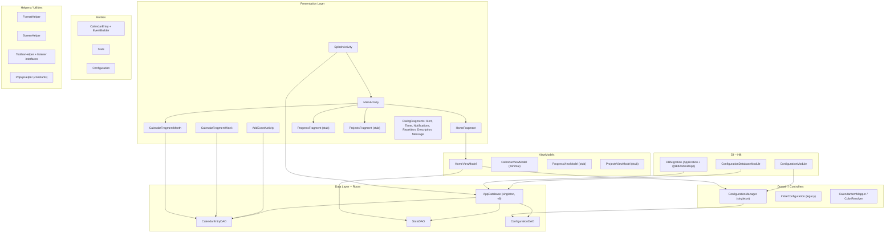
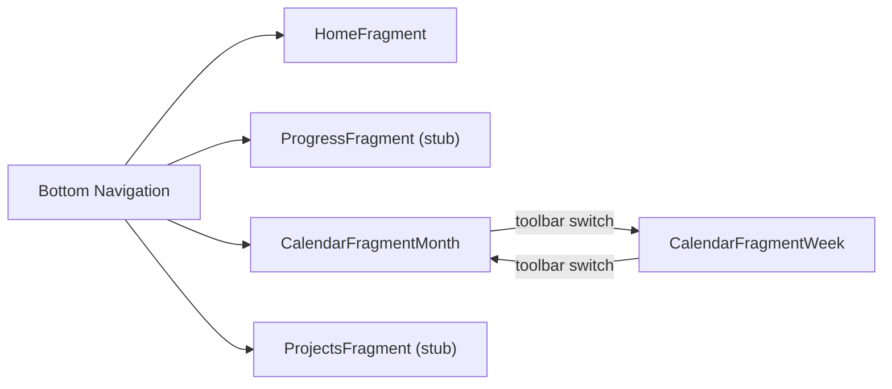

# BBetterCalendar — Architecture

Single-module Android app written in **Java 8** that combines a Pomodoro-style study timer with a calendar for managing events, tasks, and reminders. Tracks daily study time, streaks, and failed timer sessions.

> Version source of truth: [`app/build.gradle`](../../app/build.gradle) and [`build.gradle`](../../build.gradle) at the repo root. If a number here drifts, the gradle file wins.

---

## Stack and build

| Key | Value |
|-----|-------|
| Language | Java 8 (source/target compatibility 1.8) — Kotlin plugin is on the classpath only for transitive deps, no Kotlin source |
| Android Gradle Plugin | 8.13.2 |
| Gradle wrapper | 8.13 |
| compileSdk / targetSdk | 34 |
| minSdk | 21 |
| Module structure | Single `:app` module, Groovy Gradle |
| DI | Dagger Hilt 2.51.1 |
| Database | Room 2.6.1 |
| Navigation | Navigation Component 2.5.3 |
| Serialization | Gson 2.9.1 |
| UI toolkit | Views + ViewBinding (no Compose) |
| Design system | Material Components 1.9.0 |
| Calendar lib | `com.kizitonwose.calendar:view:2.5.4` |

> **Do not upgrade `com.google.android.material` past `1.9.0`** — comment in `app/build.gradle` says it breaks. The Kizitonwose calendar is pinned to 2.5.4 (newer versions need compileSdk > 33 originally; we are on 34 now but the fallback plan is documented).

---

## Layer diagram



---

## Package breakdown

### `com.example.bbettercalendar` (root)

| Class | Role |
|-------|------|
| `MainActivity` | Hosts the bottom navigation and `NavHostFragment`. Creates the notification channel for the foreground service. |

### `calendarEntries`

Unified model for all calendar items (events, tasks, reminders), differentiated by an int `type` field (1 = event, 2 = task, 3 = reminder).

| Class | Role |
|-------|------|
| `CalendarEntry` | Room `@Entity`. Fields: title, description, start/end `Calendar`, notifications (`boolean[7]`), repetition, duration, isDone, type. |
| `CalendarEntry.EventBuilder` | Serializable builder. Separate setters for day vs hour components of start/end. **Always use this** — direct field assignment bypasses required defaults. |
| `CalendarEntryDAO` | Room DAO — CRUD + queries by date, title. |
| `Task` | Empty placeholder class. |
| `AddEventActivity` | Form for creating events and tasks. Switches between layouts (`activity_create_event` / `activity_create_task`) at runtime via `setContentView`. Uses `ToolbarHelper` for save/close actions. |

### `configuration`

App-wide settings persisted in Room, wired through Hilt.

| Class | Role |
|-------|------|
| `Configuration` | Room `@Entity`. Timer time, rest time, cycle count, toggle flags (rest, auto-cycle, infinite cycles, pause, alarm, vibration). Defaults: 20 min timer, 5 min rest, 3 cycles. |
| `ConfigurationDAO` | Room DAO — insert, update, delete, `getConfiguration()`. |
| `ConfigurationManager` | Thread-safe singleton. Loads config from DAO on init, caches in memory, writes back on update via `ExecutorService`. |
| `ConfigurationDatabaseModule` | Hilt `@Module` — provides `AppDatabase` singleton. |
| `ConfigurationModule` | Hilt `@Module` — provides `ConfigurationDAO` and `ConfigurationManager`. |
| `SplashActivity` | **Real app entry point** (LAUNCHER intent filter). Initializes DB rows (Stats + Configuration), resets daily stats, updates streak, then launches `MainActivity`. |
| `InitialConfiguration` | Legacy. Extends `AppCompatActivity` but used as a singleton — its logic now lives in `SplashActivity`. The `initialize()` call in `MainActivity` is commented out. |

### `database`

| Class | Role |
|-------|------|
| `AppDatabase` | Room `@Database` (version **6**). Singleton via double-checked locking. Uses `fallbackToDestructiveMigration()` — schema changes wipe all data. Exposes `eventDao()`, `statsDao()`, `configurationDao()`. |
| `DBConverter` | Room `@TypeConverter`s: `Calendar` ↔ JSON (Gson), `boolean[]` ↔ JSON (Gson), `Location` stubs (return null). |
| `DBMigration` | **The Application class** (`android:name` in manifest), annotated with `@HiltAndroidApp`. Also holds static `Migration` objects (1→2, 2→3, 3→4) that are currently unused because destructive migration is active. |

### `helpers`

| Class | Role |
|-------|------|
| `FormatHelper` | `formatTime(millis, mask)` (supports `"HH:mm"` and `"mm:ss"`), date/time string formatting, millis↔minutes conversion. |
| `ScreenHelper` | Screen dimensions, navigation/status bar heights, dp↔px conversion. |
| `ToolbarHelper` | Implements `MenuProvider` + `View.OnClickListener`. Inflates menus, dispatches item clicks to registered listeners. Sets toolbar background from theme's `colorSecondary`. |
| `OnToolBarListener` | `onToolbarLoaded(int result)`. |
| `OnToolbarCalendarListener` | `switchFragment()`. |
| `OnToolbarHomeListener` | `onToolbarTimerClick()`. |

### `popups`

Six `DialogFragment` subclasses for modal interactions. Each communicates results back via listener interfaces.

| Class | Role |
|-------|------|
| `PopupHelper` | Constants: `ALERT_POPUP=1`, `TIMER_POPUP=2`, `MESSAGE_POPUP=3`, `REPETITION_POPUP=4`, `DESCRIPTION_POPUP=5`. |
| `OnPopupListener<T>` | Generic interface: `OnClosePopup(int type)` and `OnClosePopup(int type, T result)`. |
| `OnNotificationsPopupListener` | `OnSetNotifications(boolean[])`. |
| `AlertPopup` | Error/alert dialog. Configurable view via `selectView()`. |
| `MessagePopup` | Simple text message dialog. |
| `DescriptionPopup` | Text input dialog for event/task descriptions. |
| `NotificationsPopup` | 7 toggle buttons (5min, 10min, 15min, 30min, 1h, 3h, 1d). Returns `boolean[7]`. |
| `RepetitionPopup` | 4 toggle buttons (none, daily, weekly, monthly). Auto-dismisses after 750 ms. Returns selected int constant. |
| `TimerPopup` | Full configuration dialog for the Pomodoro timer — adjust time, rest, cycles, toggles. Returns updated `Configuration` object. |

### `stats`

| Class | Role |
|-------|------|
| `Stats` | Room `@Entity`. Tracks: totalTimeStudied, todayTimeStudied, totalTasksDone, todayTasksDone, maxStreak, currentStreak, lastDayStreak (`Calendar`), totalFails, todayFails. |
| `StatsDAO` | Fine-grained update queries (`addTimeStudied`, `addFails`, `addTasksDone`, `resetDailyStats`, streak management). |

### `ui.home`

The Pomodoro timer screen — the core feature of the app.

| Class | Role |
|-------|------|
| `HomeFragment` | Timer state machine with 6 states (STOPPED / RUNNING / PAUSED × normal / rest). Uses `CountDownTimer`. Detects background via `ActivityLifecycleCallbacks` — fails the timer after 4 seconds in background. |
| `HomeViewModel` | `AndroidViewModel`. Loads initial stats from DB, exposes `LiveData<String>` for UI text fields. Methods: `completeTimer()`, `addFails()`, `resetTimer()`, `setRestTimer()`, `updateConfiguration()`. |
| `HomeForegroundService` | Minimal `Service` that posts a sticky notification to keep the app process alive while the timer runs. |

### `ui.calendar`

Month and week calendar views.

| Class | Role |
|-------|------|
| `CalendarFragmentMonth` | Month grid via Kizitonwose Calendar. Day-detail panel + add-for-this-day button. |
| `CalendarFragmentWeek` | Week view, vendored copy of Alamkanak Week-View under `ui/calendar/weekview/`. |
| `CalendarViewModel` | Holds selected-day state. |
| `domain/CalendarItem` | UI model (id, title, start, end, type, color). |
| `domain/CalendarItemMapper` | `CalendarEntry` → `CalendarItem`. |
| `domain/ColorResolver` | Maps entry type → palette color (`calendar_item_event/task/reminder`). |
| `binders/MonthDayBinder` | Kizitonwose `MonthDayBinder` impl for `cell_month_day.xml`. |
| `binders/DayDetailAdapter` | RecyclerView adapter for the selected-day list. |
| `binders/WeekViewItemAdapter` | Adapter feeding the vendored week view. |

### `ui.progress` / `ui.projects`

Placeholder screens with stub ViewModels. No real functionality yet.

### `feedback`

| Class | Role |
|-------|------|
| `HapticFeedback` | Wrapper around `Vibrator` / `VibratorManager`. |
| `SoundFeedback` | `ToneGenerator` / `Ringtone` wrapper for the timer alarm. |

---

## Key flows

### App startup

```
SplashActivity.onCreate()
  ├─ AppDatabase.getDatabase()        // Room singleton init
  ├─ initializeStats()                // Insert Stats row if missing
  │                                   // Insert Configuration row if missing
  ├─ resetDailyStats(today, yesterday)// Zero out todayTimeStudied/todayFails/todayTasksDone if new day
  ├─ checkAndUpdateStreak(today, yesterday)
  │     ├─ If connected yesterday: increment currentStreak
  │     ├─ If gap > 1 day: reset to 1
  │     └─ Update maxStreak if needed
  └─ startActivity(MainActivity)
        └─ Bottom nav loads HomeFragment by default
```

### Pomodoro timer lifecycle

```
HomeFragment timer states:
  TIMER_STOPPED       (0) — initial / after completion
  TIMER_RUNNING       (1) — countdown active
  TIMER_PAUSED        (3) — user paused
  TIMER_STOPPED_REST  (4) — rest period ready
  TIMER_RUNNING_REST  (5) — rest countdown active
  TIMER_PAUSED_REST   (6) — rest paused

Play button flow:
  STOPPED → start concentration timer → RUNNING
  RUNNING → pause                     → PAUSED
  PAUSED  → resume from timeLeftInMillis → RUNNING
  (same pattern for REST states)

Timer reaches 0 (concentration):
  → HomeViewModel.completeTimer(timerTime) → statsDao.addTimeStudied + addTasksDone
  → If rest enabled and cycles remain: start rest timer
  → If all cycles done: show MessagePopup, reset

Timer reaches 0 (rest):
  → cyclesCompleted++
  → If auto-cycle and cycles remain: start next concentration
  → If all cycles done: show MessagePopup, reset

Background detection:
  ActivityLifecycleCallbacks.onActivityStopped
    → if TIMER_RUNNING, wait 4 s → failTimer()
  failTimer() → cancel countdown, addFails(), set isTimerFailed flag
  onActivityResumed → if isTimerFailed, show AlertPopup
```

### Creating a calendar entry

```
CalendarFragmentMonth (or Week) → FAB / "Add for this day" click
  → startActivityForResult(AddEventActivity, type=EVENT|TASK)

AddEventActivity:
  → setContentView based on type (event layout or task layout)
  → User fills: title, description, start/end date+time, notifications, repetition, duration
  → Save button → eventBuilder.build() → CalendarEntry
  → ExecutorService.execute { calendarEntryDAO.insert(entry) }
  → setResult(RESULT_OK) + finish()

Back in calendar fragment:
  → reload entries for selected day → DayDetailAdapter.submitList(...)
```

### Timer configuration

```
HomeFragment toolbar clock icon
  → TimerPopup.show()
  → User adjusts: timer time (1–90 min), rest time (1–timer min), cycles (1–15), toggles
  → Save → OnClosePopup(TIMER_POPUP, configuration)
  → HomeFragment.checkConfigChanges() → handle state transitions if needed
  → HomeViewModel.updateConfiguration(config) → ConfigurationManager → ConfigurationDAO.update()
```

---

## Navigation graph



Start destination: `HomeFragment`.

---

## Known quirks and tech debt

- **`DBMigration` naming**: It is the `Application` class (registered in manifest as `android:name`) *and* holds Room migration objects. The name implies only the migrations.
- **`InitialConfiguration` is legacy**: extends `AppCompatActivity` but is instantiated as a singleton. Logic has moved to `SplashActivity`.
- **Single entity for all entry types**: `CalendarEntry` represents events, tasks, and reminders via an int `type` field. Task-specific fields (duration, isDone) exist on every entry.
- **Destructive migration is active**: any Room schema version bump wipes the database. The commented-out migration approach is in `AppDatabase`.
- **`material` pinned to 1.9.0** — see [`app/build.gradle`](../../app/build.gradle:47).
- **Mixed-language comments**: Spanish, Catalan, and English coexist throughout. Don't normalize unless asked.
- **Thread safety**: `ConfigurationManager.getConfiguration()` can return null if the background load hasn't completed.

See also: [`architectural_patterns.md`](architectural_patterns.md) for the per-pattern playbook, and [`common_errors.md`](common_errors.md) for symptom→fix tables.
