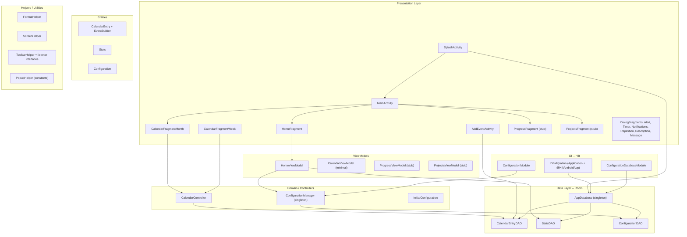

# BBetterCalendar -- Architecture Documentation Plan

## What the app is

BBetterCalendar is a single-module Android app written in **Java** (not Kotlin) targeting SDK 33 / min 21. It combines a **Pomodoro-style study timer** with a **calendar for events and tasks**, tracking streaks, study time, and failures. It uses Hilt for DI, Room for persistence, ViewBinding, and the Navigation Component. There is no Compose -- the UI is traditional Views + Fragments.

---

## Proposed deliverables

### 1. `ARCHITECTURE.md` (root) -- Detailed one-time reference

This is the main document. It will contain:

**1a. Stack and build summary**

- Java 8, AGP 7.2.1, compileSdk 33, minSdk 21
- Dependencies: Hilt 2.44, Room 2.4.2, Navigation 2.5.3, Gson 2.9.1, Material 1.9.0
- Single `:app` module, Groovy Gradle
- Warning comments from `app/build.gradle` about not upgrading appcompat or Room

**1b. Layer diagram (Mermaid)**




**1c. Package-by-package breakdown** -- Each package gets: purpose, classes with one-line role, key relationships. Packages:

- `calendarEntries` -- The unified calendar entry model (events, tasks, reminders differentiated by `type` field 1/2/3), DAO, builder pattern, and the AddEventActivity that creates them.
- `configuration` -- Configuration entity persisted in Room, Hilt DI wiring (`ConfigurationDatabaseModule`, `ConfigurationModule`), `ConfigurationManager` singleton, `SplashActivity` (real entry point), `InitialConfiguration` (legacy, partially disabled).
- `database` -- Room setup: `AppDatabase` singleton with `fallbackToDestructiveMigration`, `DBConverter` for Calendar/boolean[] via Gson, `DBMigration` which doubles as the `Application` class annotated with `@HiltAndroidApp`.
- `helpers` -- `FormatHelper` (time/date formatting), `ScreenHelper` (dp/px, bar heights), `ToolbarHelper` (implements `MenuProvider`, dispatches to listener interfaces: `OnToolBarListener`, `OnToolbarCalendarListener`, `OnToolbarHomeListener`).
- `popups` -- Six `DialogFragment` subclasses, each with its own listener callback pattern via `OnPopupListener<T>` / `OnNotificationsPopupListener`. `PopupHelper` holds type constants.
- `stats` -- `Stats` entity tracking streaks, fails, study time. `StatsDAO` with granular update queries.
- `ui.home` -- Pomodoro timer screen. `HomeFragment` manages timer state machine (STOPPED/RUNNING/PAUSED x normal/rest), `HomeViewModel` persists stats, `HomeForegroundService` keeps the app alive.
- `ui.calendar` -- Month and week calendar views. `CalendarController` handles event result callbacks and week-day positioning. `CalendarWeekAdapter` for RecyclerView. Navigation actions switch month/week.
- `ui.progress` / `ui.projects` -- Placeholder fragments with empty ViewModels.

**1d. Key flows (sequence descriptions)**

- **App startup**: `SplashActivity.onCreate` -> init Room DB -> ensure Stats and Configuration rows exist -> reset daily stats if new day -> update streak -> `startActivity(MainActivity)` -> bottom nav loads `HomeFragment` by default.
- **Pomodoro timer lifecycle**: State machine in `HomeFragment` (6 states). Background detection via `ActivityLifecycleCallbacks` -> fail after 4s in background. Cycle management (concentration -> rest -> repeat or finish). Stats updated through `HomeViewModel` -> `StatsDAO`.
- **Creating a calendar entry**: `CalendarFragmentMonth` or `Week` -> FAB click -> `AddEventActivity` (with intent extra for type) -> user fills form -> `EventBuilder.build()` -> `CalendarEntryDAO.insert()` on background thread -> `setResult` -> `finish()`.
- **Timer configuration**: `HomeFragment` toolbar clock icon -> `TimerPopup` (DialogFragment) -> edit concentration time, rest time, cycles, toggles -> save -> `HomeViewModel.updateConfiguration()` -> `ConfigurationManager` -> `ConfigurationDAO.update()`.

**1e. Navigation graph summary**

Bottom nav with 4 destinations: Home, Progress, Calendar (month), Projects. Calendar month and week are connected by navigation actions for switching.

**1f. Known quirks and tech debt**

- `DBMigration` is the Application class AND holds migration objects (naming is misleading).
- `InitialConfiguration` extends `AppCompatActivity` but is used as a singleton -- its logic has been largely moved to `SplashActivity`.
- `CalendarEntry` is a single entity for all entry types, differentiated only by an int `type` field.
- `fallbackToDestructiveMigration()` is active, meaning DB schema changes wipe all data.
- Many TODO comments (especially around notification layout management, auto-cycle, and layout switching).
- Progress and Projects screens are stubs.
- Comments are mixed Spanish/Catalan/English.

---

### 2. `AGENTS.md` (root) -- Concise context for AI assistants

Short (under 80 lines), structured for fast parsing by Cursor:

- Project identity: Android calendar + Pomodoro timer, Java, single module
- Stack: Hilt, Room, ViewBinding, Navigation Component, Gson -- no Compose, no Kotlin
- Package map (one line per package)
- Key conventions: Builder pattern for CalendarEntry, listeners for popup callbacks, ConfigurationManager singleton, executor threads for DB access
- Gotchas: DBMigration = Application class, destructive migration active, InitialConfiguration is legacy
- What not to touch: appcompat and Room versions (see build.gradle comments)

---

### 3. `.cursor/rules/bbettercalendar.mdc` -- Persistent coding rules

- Language: Java 8, no Kotlin
- DI: Hilt -- new singletons go through @Module/@Provides
- DB: Room -- new entities need TypeConverters in DBConverter if they use non-primitive types
- UI: ViewBinding, no Compose, DialogFragment for popups
- Threading: ExecutorService for DB calls, Handler for delayed UI, postValue for LiveData from background
- Naming: Spanish/Catalan comments are acceptable, class names in English

---

## File structure summary

```
BBetterCalendar/
  ARCHITECTURE.md      <-- detailed reference (sections 1a-1f above)
  AGENTS.md            <-- concise AI context
  .cursor/rules/
    bbettercalendar.mdc <-- coding rules
```

