# BBetterCalendar Modernization Roadmap

The project was last touched around November 2023 (per the Gradle wrapper timestamp). Since then the Android ecosystem has moved significantly. Here is the current gap:


| Area                   | Project          | Current stable             | Gap                                  |
| ---------------------- | ---------------- | -------------------------- | ------------------------------------ |
| AGP                    | 7.2.1            | 9.1.0                      | 2 major versions behind              |
| Gradle                 | 7.4              | 9.3.1                      | 2 major versions behind              |
| compileSdk / targetSdk | 33               | 35 (Play Store minimum)    | **Cannot publish to Play Store**     |
| Room                   | 2.4.2            | 2.8.4                      | 4 minor versions behind              |
| Hilt                   | 2.44             | 2.59.2                     | ~15 releases behind                  |
| minSdk                 | 21               | 24 (recommended)           | 21 still works but limits API access |
| Foreground service     | No type declared | Type required since API 34 | **Crashes on Android 14+**           |


The plan is organized into four phases. Each phase is self-contained: you can stop after any phase and have a working, improved app.

---

## Phase 1 -- Critical fixes (must-do)

These are **blockers**: the app will crash on modern devices and cannot be published to Google Play without them.

### 1a. Upgrade AGP and Gradle to 8.x

Going from 7.2.1 directly to 9.x is risky. The safe path is to land on **AGP 8.7.x + Gradle 8.11.x** first, which is the latest AGP 8 stable. Android Studio has an **AGP Upgrade Assistant** (`Tools > AGP Upgrade Assistant`) that automates most of this.

Key changes in AGP 8.x:

- `namespace` must be declared in `build.gradle` (moved out of `AndroidManifest.xml`)
- `buildConfig` generation is off by default
- Non-transitive R classes enforced (already enabled in this project)

Files to change:

- [gradle/wrapper/gradle-wrapper.properties](gradle/wrapper/gradle-wrapper.properties) -- update distribution URL
- [build.gradle](build.gradle) -- AGP + Hilt plugin versions
- [app/build.gradle](app/build.gradle) -- add `namespace`, update dependency versions
- [app/src/main/AndroidManifest.xml](app/src/main/AndroidManifest.xml) -- remove `package` attribute (moved to namespace)

### 1b. Bump compileSdk and targetSdk to 35

Required for Google Play. In [app/build.gradle](app/build.gradle):

```groovy
compileSdk 35
defaultConfig {
    targetSdk 35
    // ...
}
```

This triggers several behavioral changes that need code fixes (see 1c and 1d).

### 1c. Declare foreground service type

Android 14+ requires a `foregroundServiceType` on every foreground service. The `HomeForegroundService` keeps the app alive during the timer, which fits the `specialUse` type (since none of the standard types like `mediaPlayback` or `location` apply here).

In [AndroidManifest.xml](app/src/main/AndroidManifest.xml):

```xml
<uses-permission android:name="android.permission.FOREGROUND_SERVICE" />
<uses-permission android:name="android.permission.FOREGROUND_SERVICE_SPECIAL_USE" />

<service
    android:name=".ui.home.HomeForegroundService"
    android:foregroundServiceType="specialUse">
    <property
        android:name="android.app.PROPERTY_SPECIAL_USE_FGS_SUBTYPE"
        android:value="Study timer that must stay active while user concentrates" />
</service>
```

And in [HomeForegroundService.java](app/src/main/java/com/example/bbettercalendar/ui/home/HomeForegroundService.java), pass the type to `startForeground()`:

```java
if (Build.VERSION.SDK_INT >= Build.VERSION_CODES.UPSIDE_DOWN_CAKE) {
    startForeground(1, notification, ServiceInfo.FOREGROUND_SERVICE_TYPE_SPECIAL_USE);
} else {
    startForeground(1, notification);
}
```

### 1d. Handle POST_NOTIFICATIONS permission

Since Android 13 (API 33), the `POST_NOTIFICATIONS` runtime permission is required. The foreground service and notification channel in `MainActivity` need this. Add the permission to the manifest and request it at runtime in `MainActivity.onCreate()`.

---

## Phase 2 -- Dependency upgrades (medium effort, high value)

Once the build system is on AGP 8.x, these library upgrades become safe.

### 2a. Upgrade Room 2.4.2 to 2.6.x

The old comment "No actualitzar o pete tot" was likely caused by an incompatibility with the old AGP/Gradle versions, not Room itself. On AGP 8.x, Room 2.6.x works fine. Key benefits:

- Automatic migrations (`@AutoMigration`)
- Better error messages
- Performance improvements

Avoid jumping straight to 2.8.x in this phase because it brings KSP requirements. Room 2.6.1 is the sweet spot for a Java + annotationProcessor project.

### 2b. Upgrade Hilt 2.44 to 2.51.x

Hilt 2.51 is the latest version compatible with AGP 8.x (versions past 2.52 start requiring AGP 9). This brings years of bug fixes and performance improvements.

### 2c. Upgrade remaining AndroidX libraries

Update in [app/build.gradle](app/build.gradle):

- `material` 1.9.0 to 1.12.x
- `lifecycle` 2.5.1 to 2.8.x
- `navigation` 2.5.3 to 2.8.x
- `appcompat` 1.6.1 to 1.7.x (the "don't upgrade" comment was likely an AGP-era issue)
- `constraintlayout` 2.1.4 to 2.2.x

### 2d. Raise minSdk from 21 to 24

API 21-23 (Android 5.0-6.0) represents less than 2% of active devices in 2026. Raising to 24 allows:

- Java 8 desugaring is no longer needed for most APIs
- `java.time` APIs available without desugaring
- Simplified notification channel code

---

## Phase 3 -- Architecture cleanup (moderate effort, high maintainability)

These are the "easy wins" that make the codebase much more maintainable without changing features.

### 3a. Rename DBMigration to BBetterCalendarApp

The `Application` class being named `DBMigration` is the single most confusing thing in the codebase. Rename the class and update the manifest reference. Move migration objects to a separate `Migrations` class or into `AppDatabase`.

### 3b. Remove InitialConfiguration

`InitialConfiguration` extends `AppCompatActivity` but is used as a singleton. Its `initialize()` call is already commented out in `MainActivity`. All its logic already lives in `SplashActivity`. Delete the class entirely.

### 3c. Replace destructive migration with real migrations

`fallbackToDestructiveMigration()` means every schema change wipes user data. Now that the schema is relatively stable, switch to the commented-out migration-based approach in `AppDatabase`. With Room 2.6+, `@AutoMigration` handles simple changes automatically.

### 3d. Fix ConfigurationManager null safety

`getConfiguration()` can return null if the async load hasn't completed. Fix by using a `CountDownLatch` or `Future` to block until the first load completes, or load synchronously during `SplashActivity` (which already runs on a background thread).

### 3e. Extract magic numbers into constants

Scattered across the codebase:

- Timer states (0, 1, 3, 4, 5, 6) in `HomeFragment` -- move to an enum or IntDef
- Entry types (1, 2, 3) -- already have constants in `AddEventActivity` but used as raw ints elsewhere
- Notification indices (0-6) -- create named constants
- Popup type constants are in `PopupHelper` (good), but the listener dispatch uses raw ints

### 3f. Enable R8 for release builds

In [app/build.gradle](app/build.gradle), `minifyEnabled` is `false`. Enable it for release to shrink the APK and obfuscate code:

```groovy
release {
    minifyEnabled true
    shrinkResources true
    proguardFiles getDefaultProguardFile('proguard-android-optimize.txt'), 'proguard-rules.pro'
}
```

---

## Phase 4 -- Modernization (larger effort, future-proofing)

These are strategic improvements for the long term. Each is independently valuable.

### 4a. Gradual Kotlin migration

Java 8 works but Kotlin is the official Android language and enables coroutines, sealed classes, data classes, and null safety. Migrate file by file starting with the simplest (helpers, entities, ViewModels). Java and Kotlin coexist in the same module.

### 4b. Replace ExecutorService threading with Kotlin coroutines

The codebase has ~15 instances of manual `ExecutorService.execute()` for Room calls. With Kotlin + Room, DAO methods can be `suspend` functions, eliminating all the executor boilerplate and making error handling much cleaner.

### 4c. Consider Jetpack Compose for new screens

The stub screens (Progress, Projects) are perfect candidates for building in Compose. Compose and Views coexist, so there is no need to rewrite existing screens. This gives a migration path without a big-bang rewrite.

### 4d. Migrate Groovy Gradle to Kotlin DSL

Groovy `.gradle` files to `.gradle.kts`. Better IDE support, type safety, and autocomplete. AGP 9.x strongly encourages this.

---

## Recommended order (effort vs impact)

```mermaid
graph LR
    subgraph phase1 [Phase 1 -- Critical]
        A1["1a. AGP 7->8"]
        A2["1b. targetSdk 35"]
        A3["1c. FG service type"]
        A4["1d. POST_NOTIFICATIONS"]
    end

    subgraph phase2 [Phase 2 -- Dependencies]
        B1["2a. Room 2.6"]
        B2["2b. Hilt 2.51"]
        B3["2c. AndroidX updates"]
        B4["2d. minSdk 24"]
    end

    subgraph phase3 [Phase 3 -- Cleanup]
        C1["3a. Rename DBMigration"]
        C2["3b. Delete InitialConfig"]
        C3["3c. Real migrations"]
        C4["3d. ConfigMgr null safety"]
        C5["3e. Extract constants"]
        C6["3f. Enable R8"]
    end

    subgraph phase4 [Phase 4 -- Modernize]
        D1["4a. Kotlin migration"]
        D2["4b. Coroutines"]
        D3["4c. Compose for new screens"]
        D4["4d. Gradle KTS"]
    end

    A1 --> A2 --> A3 --> A4
    A4 --> B1
    B1 --> B2 --> B3 --> B4
    B4 --> C1
    C1 --> C2 --> C3 --> C4 --> C5 --> C6
    C6 --> D1
    D1 --> D2 --> D3 --> D4
```




Phase 1 is a few hours of work. Phase 2 is about a day. Phase 3 tasks are independent and can be done one at a time over days. Phase 4 is ongoing, file-by-file work.